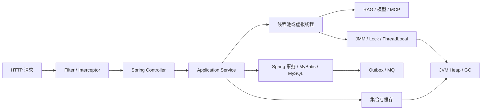

# Java 核心 + JVM + 并发 + Spring：重构说明与学习地图

> 目标岗位：互联网大厂 Java 后端 / Agent 应用开发 / AI 平台工程师  
> 项目基线：Java 21 LTS + Spring Boot 3.5.x  
> 现代补充：Java 25 LTS、Spring Boot 4.1、JDK 24+ 虚拟线程改进  
> 总题量：72 道；70% 验收线：51 道主线题

---

## 一、为什么不能沿用五份旧文件的章节顺序

原材料分别来自 Java 基础、集合、并发、JVM 和 Spring，但真实学习依赖并不是五门课彼此独立：

```text
Java 源码如何运行
  ↓
对象、引用、equals/hashCode、泛型
  ↓
集合怎样保存对象
  ↓
多个线程为何会争抢集合与对象
  ↓
JMM、锁、线程池与虚拟线程
  ↓
对象在 JVM 中分配、加载与回收
  ↓
Spring 如何用反射、容器和代理管理这些对象
  ↓
Spring Boot 如何把请求、事务、SQL、微服务串起来
```

旧材料存在四类学习障碍：

1. **前置知识倒置**：还不知道对象和引用，就开始背 HashMap、JMM 和三级缓存。
2. **重复题过多**：同一份材料多次询问 IOC、AOP、HashMap、线程停止、锁区别，答案彼此割裂。
3. **旧版本口径**：把偏向锁当现代 JDK 固定阶段；把 Spring Boot 自动装配主要归结为 `spring.factories`；把 CMS 当现代首选。
4. **项目链缺失**：知道单个术语，却无法解释 Agent 请求为什么变慢、事务为什么失效、缓存为什么 OOM。

因此本教材不保留原文件章节，而保留真正高频、可迁移的核心问题，并按人类认知顺序重新编号。

---

## 二、九章新结构

| 新章节 | 先解决什么问题 | 题号 |
|---|---|---:|
| 第 1 章 Java 运行与类型 | Java 到底怎样跑；值、对象和字符串是什么 | Q001–Q008 |
| 第 2 章 对象与框架基础 | 接口、泛型、异常、反射为何能支撑框架 | Q009–Q016 |
| 第 3 章 集合与数据结构 | List、Map、Queue 应怎样按业务选型 | Q017–Q024 |
| 第 4 章 并发基础 | 线程为什么互相看不见；锁和 CAS 怎样建立规则 | Q025–Q032 |
| 第 5 章 并发工程 | 线程池、虚拟线程、上下文、背压和死锁怎样治理 | Q033–Q040 |
| 第 6 章 JVM 内存与类加载 | 对象在哪里、类怎样加载、堆外为什么会 OOM | Q041–Q048 |
| 第 7 章 GC 与排障 | 对象何时回收；G1/ZGC 与线上工具怎样使用 | Q049–Q056 |
| 第 8 章 Spring 核心 | 容器怎样创建、注入、代理和管理事务 | Q057–Q064 |
| 第 9 章 Spring Boot 与项目 | 请求、自动装配、SQL、微服务和 Agent 链路 | Q065–Q072 |

---

## 三、被合并的旧题

### Java 基础

以下旧题不再拆成十几个孤立问题：

- Java 特点、跨平台、JDK/JRE/JVM、编译解释；
- 基本类型、包装类型、Integer 缓存、装箱拆箱；
- 面向对象、接口、抽象类、重载、重写；
- 反射、注解、异常、泛型和 Java 新特性。

它们被合并到 Q001–Q016。每道题先建立运行画面，再讲语法和框架用途。

### 集合

旧文件中大量重复的 HashMap put/get、扩容、负载因子、红黑树、Key、equals/hashCode 被合并为 Q020–Q023。  
ArrayList、LinkedList、Vector、CopyOnWrite 和 Queue 被按“访问方式与并发模型”重排为 Q017–Q024。

### 并发

重复的线程停止、sleep/wait、synchronized/ReentrantLock、CAS、volatile、线程池参数被压缩为两条主线：

```text
JMM → volatile → synchronized/Lock → CAS/AQS
ThreadLocal → 线程池 → CompletableFuture/虚拟线程 → 背压/死锁
```

### JVM

内存区域、对象创建、类加载和引用归入第 6 章；GC 算法、G1/ZGC、OOM 和 CPU 排障归入第 7 章。  
CMS 只作为历史对照，不再单独分配主线题。

### Spring

IOC、DI、BeanDefinition、生命周期、AOP、事务和循环依赖合成容器运行链。  
Spring Boot 自动装配使用现代 `AutoConfiguration.imports` 口径；Spring MVC、MyBatis 和 Spring Cloud 按一次请求路径放到最后一章。

---

## 四、明确跳过的低收益内容

以下内容不是“完全没价值”，但不进入本轮 72 道主线题：

- 为记忆位数而单独背八种类型范围；
- `try/finally` 中多个 return 的偏题；
- 纯手写 AVL/红黑树旋转；
- 过时的 Vector/Hashtable 源码细节；
- 手写完整 AQS 锁、手写类加载器作为普通校招必会题；
- CMS 参数调优、永久代参数；
- 大量 Spring 设计模式枚举；
- 冷门注解列表、Starter 名称背诵；
- 与贯穿项目无关的 GUI、Applet、RMI 等历史技术。

遇到面试官追问时，教材会在相邻主线题中给出理解入口，但不让初学者先花时间背低频细节。

---

## 五、统一贯穿项目

所有章节使用同一个项目，而不是每题更换背景：

> 多租户 Agent + RAG Java 平台：Spring Boot 接收请求，读取租户上下文，并行查询向量库与用户画像，调用模型和 MCP 工具，写入 MySQL，通过 Redis 缓存，并由 MQ 发送审计和恢复事件。

知识点在项目中的位置：



---

## 六、每道题的固定教学闭环

1. 为什么此时学习；
2. 先用人话建立直觉；
3. JVM / 框架内部运行步骤；
4. 贯穿项目使用位置；
5. 可读但会制造事故的 Java 写法；
6. 更稳妥的企业级写法；
7. 2～3 分钟面试口述；
8. 两个递进追问；
9. 一句记忆钩子。

这保证初学者不是“背到了答案”，而是先能解释，再能落地，最后能口述。

---

## 七、版本校正

- Java 21 仍作为项目示例基线，因为虚拟线程已经正式可用，企业生态成熟。
- Java 25 于 2025-09-16 GA，并被多数厂商作为 LTS；教材把它作为现代面试补充。
- JDK 15 起偏向锁默认禁用，不能再把“偏向锁→轻量级锁→重量级锁”当现代必经流程。
- JDK 24 的 JEP 491 已消除 `synchronized` 导致的绝大多数虚拟线程 pinning。
- 多数现代 HotSpot 配置默认选择 G1；严格低暂停的大堆场景再评估 ZGC。
- Spring Boot 现代自动配置候选注册使用 `AutoConfiguration.imports`。
- 截至 2026-07，Spring Boot 4.1 要求 Java 17+，兼容到 Java 26；本教材项目代码仍保持 Java 21 / Boot 3.5.x 兼容思路，并在题目中标明升级差异。

---

## 八、学习建议

不要一次背 72 道题。每章按以下节奏：

```text
第 1 遍：只读“人话解释”和流程
第 2 遍：运行事故代码与改进代码
第 3 遍：遮住答案，按“结论→机制→项目→边界”口述
第 4 遍：回答递进追问
```

完成第 10 份文件中的 51 道主线题，即达到 70% 验收线。
