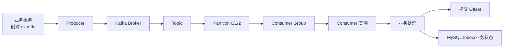
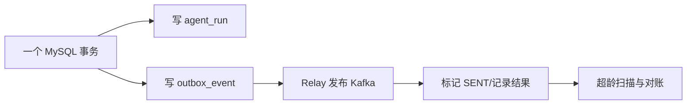

# Kafka 4.3.x + RocketMQ 5.5 企业级消息队列教材

> **定位**：面向互联网大厂 Agent 应用开发、Java 后端、AI 平台与数据基础设施岗位。  
> **学习目标**：让零基础学习者先建立完整消息链路，再掌握可靠性、幂等、顺序、积压、事务与高可用，最终能够独立回答本教材 30 道高频与深挖题中的 70% 以上。  
> **技术主线**：Kafka 优先，RocketMQ 次之，RabbitMQ 只保留选型所需内容。  
> **版本基线**：Apache Kafka 4.3.x、Apache RocketMQ 5.5.0、Java 17+、Spring Boot 3.x。  
> **贯穿项目**：NexusAgent——多租户企业知识与业务执行平台。  
> **难度体系**：简单 → 中等 → 中等偏上 → 困难。低频、项目不用、只靠记源码类名的题不纳入主线。  
> **诚实边界**：项目数字均为教学假设，面试时必须替换为自己真实压测或实习数据，不得虚构生产经历。

---

# 第一篇：先建立一张不会混乱的消息队列地图

## 1. 先看一条消息的一生



这条链路里有五个必须分开的“成功”：

1. **业务事实成功**：订单、Run、文档版本等是否已在 MySQL 提交；
2. **发送成功**：Producer 是否得到 Broker 的明确响应；
3. **存储成功**：Kafka Leader 与同步副本是否达到配置要求；
4. **消费成功**：消费者业务逻辑是否提交；
5. **进度成功**：Consumer Group 的 Offset 是否推进。

任何一个“成功”都不能替代另外四个。面试中最常见的错误，就是用一个 ACK 推导整个分布式链路已经成功。

## 2. Kafka 核心概念：按人类学习顺序理解

### 2.1 Broker 是什么？

Broker 是 Kafka 集群中的服务器进程。它负责接收 Producer 请求、保存分区日志、向 Consumer 返回数据、参与副本同步，并承担部分协调职责。Kafka 4.x 的集群元数据由 KRaft Controller 管理，不再依赖 ZooKeeper。

### 2.2 Topic 是什么？

Topic 是消息的逻辑分类，例如：

```text
agent.run.command
rag.document.event
tool.audit.event
evaluation.result
```

Topic 不是一个“单队列文件”。它会继续拆成多个 Partition。

### 2.3 Partition 是什么？

Partition 是 Topic 的并行、存储和顺序边界。每个 Partition 都是一条只追加的有序日志：

```text
agent.run.command
├── Partition 0: offset 0, 1, 2, 3...
├── Partition 1: offset 0, 1, 2, 3...
└── Partition 2: offset 0, 1, 2, 3...
```

Partition 带来三件事：

- 多分区可并行写入和消费；
- 分区副本可分布到不同 Broker；
- Kafka 只保证单分区内的日志顺序，不保证跨分区全局顺序。

### 2.4 Offset 是什么？

Offset 是一条消息在某个 Partition 中的位置。要区分两类 Offset：

- **Log Offset**：消息在分区日志中的位置；
- **Committed Offset**：某个 Consumer Group 声明下次从哪里继续消费的进度。

Offset 像书签，但“书签已翻到第 100 页”不等于第 1～99 页的业务副作用都成功。批量消费、异步线程和提交时机都会产生失败窗口。

### 2.5 Key/分区键是什么？

Producer 发送记录时可以携带 Key。默认分区策略会让相同 Key 在分区数量不变时稳定进入同一 Partition。常见 Key：

- `orderId`：保证同一订单事件局部有序；
- `runId`：保证同一 Agent Run 状态推进有序；
- `documentId`：保证同一文档版本事件有序；
- `tenantId`：通常不建议单独作为 Key，容易形成超级热点。

### 2.6 Replica、Leader、Follower、ISR 是什么？

一个 Partition 可以有多个 Replica：

- Leader 处理该分区的客户端读写；
- Follower 从 Leader 拉取日志；
- ISR 是当前保持同步资格的副本集合；
- Leader 故障后，Controller 从合格副本中选新 Leader。

**副本数、ISR、`acks`、`min.insync.replicas` 是一组配置，不能拆开背。**

### 2.7 Consumer Group 是什么？

同一 Consumer Group 内，某个 Partition 在同一时刻只分配给一个 Group Member；一个 Member 可以消费多个 Partition。不同 Consumer Group 可以各自读取同一 Topic，因此：

- 同组：分摊工作；
- 不同组：各自获得一份逻辑消息流。

### 2.8 Kafka 是推还是拉？

Kafka Consumer 主动 Fetch，属于拉取模型。没有数据时使用长轮询等机制等待，而不是毫无间隔地空转。拉取让消费者根据自己的能力控制节奏，但消费者仍必须处理背压、超时、重平衡与 Offset。

## 3. RocketMQ 核心概念：建立对应关系，但不要说“完全相同”

| Kafka | RocketMQ 5.x | 相似点 | 关键差异 |
| --- | --- | --- | --- |
| Broker | Broker/Proxy | 接收、保存、投递消息 | RocketMQ 还有 NameServer 路由体系，5.x 客户端可经 Proxy/gRPC |
| Topic | Topic | 逻辑业务分类 | RocketMQ 5.x Topic 还约束 NORMAL/FIFO/TRANSACTION/DELAY 类型 |
| Partition | MessageQueue/消息组相关路由 | 都提供并行与局部顺序边界 | RocketMQ 正文统一进入 CommitLog，ConsumeQueue 是逻辑索引，不能简单说二者物理模型完全相同 |
| Key | Message Key / Message Group | 业务身份、检索或顺序路由 | 5.x FIFO 首先应讲 Message Group |
| Consumer Group | Consumer Group | 同组分摊、不同组独立消费 | 5.x PushConsumer 可采用消息级负载均衡 |
| Offset | ConsumerOffset/消费状态 | 记录组的消费进度 | SDK 暴露的确认与重试体验不同 |
| Kafka Transaction | Transaction Message | 都处理事务范围内的一致性 | Kafka 事务主要覆盖 Kafka 记录与 Offset；RocketMQ 半消息关联本地事务并最终一致 |

### 3.1 同步刷盘到底是什么？

同步刷盘讨论的是 **Broker 本机内存页中的数据何时落到持久介质**；同步复制讨论的是 **数据何时到达其他节点**。二者不是同一个开关。

```text
Producer ACK
├── 本机写入/刷盘条件
└── 副本同步条件
```

面试时必须先问：“这个 ACK 确认的是内存、Page Cache、磁盘，还是多个副本？”

### 3.2 半事务消息是什么？

RocketMQ 半消息已经到 Broker，但暂时不可投递。Producer 执行本地事务后发送 Commit 或 Rollback；结果未知时，Broker 通过事务回查获得最终判断。它保证的是本地事务与消息可投递之间的最终一致，不会自动保证下游消费业务一定成功。

## 4. 六个最容易混淆的词

| 词 | 正确含义 | 常见误区 |
| --- | --- | --- |
| ACK | 某一阶段的确认 | 把 Broker ACK 当成端到端成功 |
| Offset | 某组的消费位置 | 认为提交 Offset 会立即删除消息 |
| Retention | 日志保留与清理策略 | 认为消息一消费就物理删除 |
| Retry | 对不确定或暂时失败的再次尝试 | 无限制重试、换新业务 ID 重试 |
| Idempotence | 重复执行结果等同一次 | 只在 Redis `SETNX` 一下就宣称端到端幂等 |
| Exactly-once | 在特定边界内实现一次效果 | 宣称跨 MySQL、Kafka、HTTP、外部工具天然全局一次 |

---

# 第二篇：NexusAgent 企业级消息设计

## 5. 为什么本项目 Kafka 优先？

NexusAgent 包含文档入库事件、Agent Run 状态、工具审计、评估结果和可观测事件。主链路更看重：

- 高吞吐事件流；
- 可回放和按 Offset 重建；
- 多 Consumer Group 并行订阅；
- Kafka Connect/Streams 与数据平台生态；
- KRaft 集群与成熟跨集群复制方案。

RocketMQ 作为第二选择，重点承接：

- 业务原生延时消息；
- FIFO 消息组；
- 本地事务与半消息；
- 更内建的消费重试与死信体验；
- Java 微服务团队偏业务消息的场景。

## 6. Topic 与 Consumer Group 规划

```text
Topic
├── agent.run.command          Key=runId
├── agent.run.event            Key=runId
├── rag.document.command       Key=documentId
├── rag.document.event         Key=documentId
├── tool.audit.event           Key=tenantId + operationId
└── evaluation.result          Key=evaluationRunId
```

```text
Consumer Group
├── ingestion-worker
├── agent-worker
├── stream-projector
├── audit-sink
└── evaluation-aggregator
```

设计原则：

1. Topic 按数据语义、保留策略、安全等级和吞吐特征划分，不按每个微服务机械建 Topic；
2. Key 选择局部顺序实体，不把所有租户消息压到一个分区；
3. Consumer Group 表达“这一类业务效果只需要同组一份”，不是实例名称；
4. 重试 Topic、DLQ、回放 Topic 必须有负责人、保留期和处置流程。

## 7. 可靠发布：MySQL Outbox



Outbox 解决“数据库提交成功但消息没发出去”的双写窗口。它并不消灭重复发送，因此消费者还需要 Inbox/唯一约束/状态版本。

## 8. 幂等消费：稳定业务身份 + 数据库裁决

推荐使用：

```text
eventId       唯一业务事件
aggregateId   runId/documentId/orderId
version       聚合状态版本
operationId   外部工具副作用身份
```

消费者在一个数据库事务中：

1. 插入 `inbox_record(event_id)`，依赖唯一索引；
2. 检查业务版本是否允许推进；
3. 修改业务状态；
4. 提交成功后再推进 Offset。

Redis 可作为热点加速，但不应成为关键金融/订单幂等的唯一事实。

## 9. 重试、DLQ 与补偿

错误分类：

| 错误 | 示例 | 动作 |
| --- | --- | --- |
| 瞬时错误 | 网络抖动、短暂限流 | 有界指数退避 + 抖动 |
| 依赖过载 | MySQL 连接池耗尽 | 降并发、暂停分区、保护下游 |
| 数据错误 | Schema 不兼容、字段缺失 | 立即隔离到错误 Topic/DLQ |
| 永久业务拒绝 | 权限不足、状态冲突 | 记录终态，不重试 |
| 结果未知 | 外部工具超时 | 用 operationId 查询，不生成新身份 |

DLQ 不是垃圾桶。每条死信必须能回答：负责人是谁、如何修复、是否回放、回放是否仍使用原 eventId、怎样证明没有重复副作用。

## 10. 监控与容量

必须同时看三类指标：

- **原因指标**：Produce/Fetch 延迟、Request Queue、Under-replicated、ISR 变化、磁盘、网络、GC；
- **结果指标**：Consumer Lag、最老消息年龄、业务完成 P95/P99、超时率；
- **正确性指标**：Outbox 超龄、Inbox 冲突、版本倒退、重复 operationId、对账差异。

追赶能力不是“消费 TPS 大于生产 TPS”这么简单：

```text
净追赶速率 = 恢复后的消费速率 - 当前生产速率
预计清空时间 = 当前积压量 / 净追赶速率
```

还要验证下游数据库、向量库和第三方 API 能否承受扩容后的并发。

---

# 第三篇：30 道大厂高频与深挖题

## 题目地图

| 题号 | 题目 | 类型 | 难度 |
| --- | --- | --- | --- |
| Q01 | 什么是消息队列？一条消息经历哪些阶段？ | 核心面试题 | 简单 |
| Q02 | 为什么使用 MQ？解耦、异步、削峰如何落到项目？ | 高频面试题 | 简单 |
| Q03 | MQ 有什么缺点？什么场景不应该使用？ | 场景面试题 | 中等 |
| Q04 | Kafka 的 Broker、Topic、Partition、Offset、Key 分别是什么？ | 核心面试题 | 简单 |
| Q05 | Kafka Consumer Group 与分区、消费者实例是什么关系？ | 高频面试题 | 中等 |
| Q06 | Kafka 为什么采用拉取？Kafka 4.x 重平衡有什么变化？ | 高频面试题 | 中等 |
| Q07 | Kafka 如何保证消息顺序？ | 高频面试题 | 中等 |
| Q08 | Kafka 为什么快？ | 高频面试题 | 中等 |
| Q09 | Kafka 的日志保留、回放和“消费后不删除”如何理解？ | 高频面试题 | 中等 |
| Q10 | Kafka 如何通过 KRaft、副本、ISR 和 Leader 选举实现高可用？ | 高频面试题 | 中等偏上 |
| Q11 | `acks`、重试、幂等 Producer 如何一起工作？ | 高频面试题 | 中等偏上 |
| Q12 | 如何保证消息不丢失？ | 场景面试题 | 中等偏上 |
| Q13 | 为什么会重复消费？如何设计业务幂等？ | 场景面试题 | 中等偏上 |
| Q14 | At-most-once、At-least-once、Exactly-once 有什么边界？ | 资深工程师题 | 中等偏上 |
| Q15 | MySQL 与 Kafka 如何保证最终一致？Outbox 为什么更通用？ | 项目深挖题 | 困难 |
| Q16 | Kafka 消费成功与 Offset 提交顺序怎么设计？ | 高频面试题 | 中等偏上 |
| Q17 | Kafka 如何设计重试 Topic、DLQ 和回放？ | 项目深挖题 | 中等偏上 |
| Q18 | Kafka 积压几百万条如何处理？ | 场景面试题 | 困难 |
| Q19 | 增加 Partition 就一定能解决积压吗？ | 资深工程师题 | 困难 |
| Q20 | Kafka 如何做监控、容量规划和压测？ | 资深工程师题 | 困难 |
| Q21 | RocketMQ 的 Topic、MessageQueue、CommitLog、ConsumeQueue 是什么？ | 核心面试题 | 中等 |
| Q22 | 项目为什么选择 RocketMQ？ | 高频面试题 | 中等 |
| Q23 | RocketMQ 5.x 如何保证 FIFO 顺序？ | 高频面试题 | 中等偏上 |
| Q24 | RocketMQ 5.x 延时消息如何工作？ | 高频面试题 | 中等偏上 |
| Q25 | RocketMQ 事务消息如何实现？ | 高频面试题 | 困难 |
| Q26 | Kafka 与 RocketMQ 如何选型？确认与 Broker 架构有何差异？ | 高频对比题 | 困难 |
| Q27 | RabbitMQ 只需掌握哪些内容？什么时候选它？ | 选型题 | 中等 |
| Q28 | 消息队列与观察者、发布订阅模式是什么关系？ | 核心面试题 | 中等 |
| Q29 | 让你从零设计一个 MQ，如何回答？ | 资深工程师系统设计题 | 困难 |
| Q30 | 深挖 NexusAgent：如何设计一条可恢复异步执行链？ | 项目深挖题 | 困难 |

---
