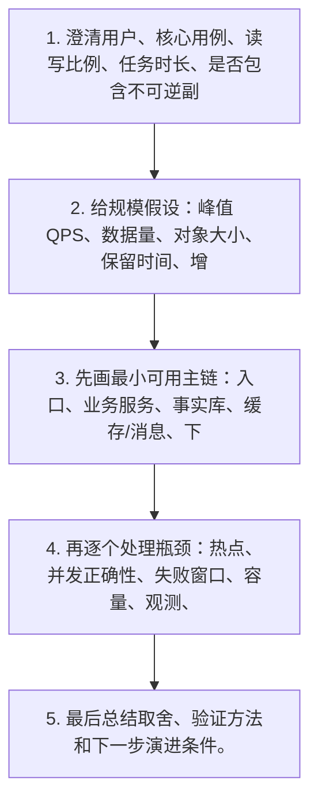
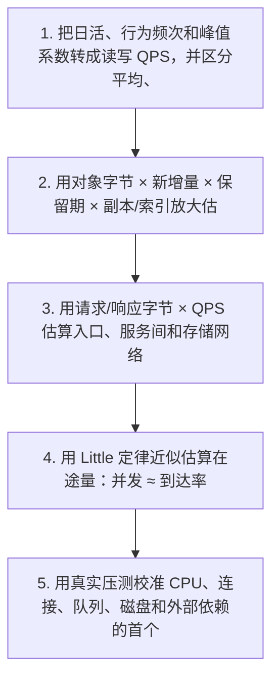
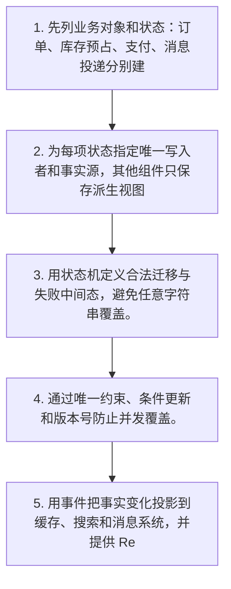
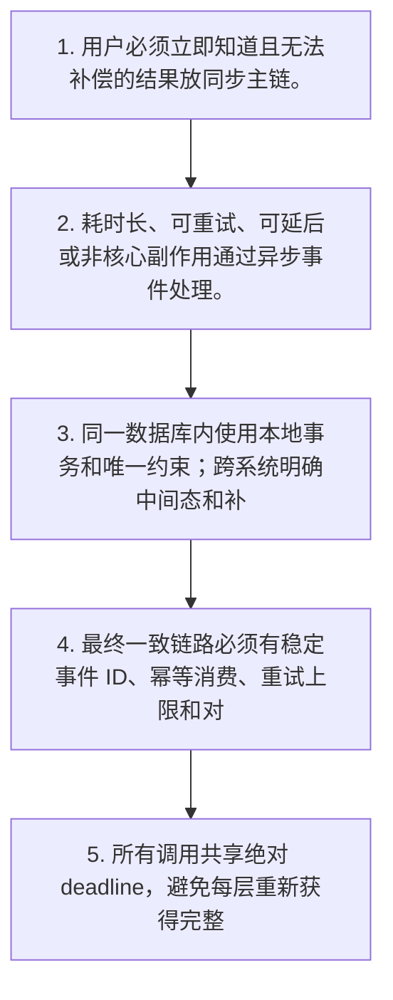
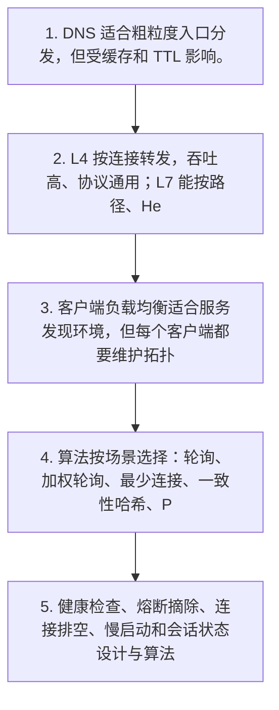

# 第一章：系统设计答题基础与通用架构

## Q01. 系统设计面试应该按什么顺序回答，而不是直接堆组件？

**题型**：高频基础题  
**实际难度**：简单偏中等  
**学习层级**：70% 必会题

### 1. 为什么会问这道题

面试官只说“设计一个高并发系统”，候选人立即回答 Redis、MQ、分库分表，却没有说明用户是谁、成功是什么、数据能不能丢。

### 2. 初学者先记住什么

> 最先定义的是业务对象、状态机、唯一业务 ID、事实源和成功后置条件，而不是组件清单。

### 3. 设计步骤

1. 澄清用户、核心用例、读写比例、任务时长、是否包含不可逆副作用。
2. 给规模假设：峰值 QPS、数据量、对象大小、保留时间、增长率；未知数字明确说是假设。
3. 先画最小可用主链：入口、业务服务、事实库、缓存/消息、下游。
4. 再逐个处理瓶颈：热点、并发正确性、失败窗口、容量、观测、安全和容灾。
5. 最后总结取舍、验证方法和下一步演进条件。

### 4. 容易制造事故的回答

> “我会使用微服务、Redis、RocketMQ、MySQL 主从和 Kubernetes，所以系统高并发高可用。”

这类回答的问题不是“技术名不够多”，而是没有说明状态保存在哪里、谁拥有最终写权、失败后由谁恢复，以及如何证明没有重复或数据错误。

### 5. 企业级可落地方案

> 先声明业务目标和假设，再用一条正常链、一条失败链和一条恢复链解释设计；每引入一个组件都说明它关闭了哪个失败窗口，又增加了什么成本。

### 6. 2～3 分钟面试口述回答

系统设计面试我会先澄清需求，而不是直接报技术名。第一步确认用户、核心流程、读写比例、是否允许异步、数据能否丢以及失败能否补偿。第二步给出峰值 QPS、对象大小和保留时间等容量假设，未知数字会明确标注为假设。第三步先画最小可用方案，确定业务状态、唯一 ID、事实库和关键 API。之后再按照热点、并发、一致性、可用性、容量、安全和观测逐层演进。

每个组件必须对应一个问题：缓存降低读压力但带来陈旧；消息削峰但带来重复和积压；分片扩容量但带来跨分片事务；副本提高可用性但不等于零丢失。最后我会给验证方案，例如压测饱和点、故障注入、数据对账和 RPO/RTO 演练。这样回答能证明我理解业务边界，而不是只会背架构图。

### 7. 递进追问

- 面试官不给规模数字怎么办？
- 怎样在 20 分钟内控制回答深度？

### 8. 一句话记忆

> **先定义正确性，再设计正常链；先找失败窗口，再决定是否加组件。**

---

## Q02. 如何做容量估算：QPS、存储、带宽和并发怎样从业务推导？

**题型**：高频基础题  
**实际难度**：中等  
**学习层级**：70% 必会题

### 1. 为什么会问这道题

一个接口平均只需 100ms，但活动期间请求从 1,000 QPS 提升到 10,000 QPS；团队只按平均值扩容，忽略长尾和重试。

### 2. 初学者先记住什么

> 容量模型必须按任务类型看分布；秒杀读请求、创建订单写请求和异步通知不是同一种工作单位。

### 3. 设计步骤

1. 把日活、行为频次和峰值系数转成读写 QPS，并区分平均、峰值和突发。
2. 用对象字节 × 新增量 × 保留期 × 副本/索引放大估算存储。
3. 用请求/响应字节 × QPS 估算入口、服务间和存储网络带宽。
4. 用 Little 定律近似估算在途量：并发 ≈ 到达率 × 平均停留时间。
5. 用真实压测校准 CPU、连接、队列、磁盘和外部依赖的首个饱和点。

### 4. 容易制造事故的回答

> 把日均请求除以 86,400 得到平均 QPS，再乘 2 作为机器容量。

这类回答的问题不是“技术名不够多”，而是没有说明状态保存在哪里、谁拥有最终写权、失败后由谁恢复，以及如何证明没有重复或数据错误。

### 5. 企业级可落地方案

> 同时保留峰值、P95/P99 服务时间、突发持续时间、重试率和降级流量；容量余量由扩容速度和故障模式决定。

### 6. 2～3 分钟面试口述回答

容量估算我会先把业务量转换成系统工作量。比如日活乘以每人每天操作次数得到日请求量，再结合活动窗口估算峰值，而不是只用全天平均。随后按接口拆分读写 QPS、对象大小、返回字节和下游调用次数。存储量等于每天新增对象数乘单对象大小、保留时间和索引、副本放大；网络量要分别看入口、服务间、缓存、数据库和消息链路。

并发可以用 Little 定律做第一版估算，即到达率乘平均停留时间，但 Agent、秒杀和慢工具都有长尾，因此还要看 P95/P99 和任务类型。最后用阶梯升压、突发和下游抖动压测找到第一个饱和点，观察队列年龄、连接等待、拒绝率和业务成功率。估算只是建模起点，生产基线和压测结果才决定最终容量。

### 7. 递进追问

- Little 定律什么时候不能机械使用？
- 为什么 CPU 低也可能已经容量不足？

### 8. 一句话记忆

> **先定义正确性，再设计正常链；先找失败窗口，再决定是否加组件。**

---

## Q03. 系统设计中如何确定数据模型、状态机和唯一事实源？

**题型**：高频基础题  
**实际难度**：中等  
**学习层级**：70% 必会题

### 1. 为什么会问这道题

订单服务、Redis 和消息消费者都能修改订单状态，出现一个地方显示已取消、另一个地方仍显示已支付。

### 2. 初学者先记住什么

> 事实源不是永远等于 MySQL，而是某项状态唯一具有最终裁决权的位置；缓存、搜索索引和 MQ 通常不是业务最终事实。

### 3. 设计步骤

1. 先列业务对象和状态：订单、库存预占、支付、消息投递分别建模。
2. 为每项状态指定唯一写入者和事实源，其他组件只保存派生视图。
3. 用状态机定义合法迁移与失败中间态，避免任意字符串覆盖。
4. 通过唯一约束、条件更新和版本号防止并发覆盖。
5. 用事件把事实变化投影到缓存、搜索和消息系统，并提供 Reconciler 对账。

### 4. 容易制造事故的回答

> 订单表、Redis Hash、MQ 消息都保存 status，哪个更新快就以哪个为准。

这类回答的问题不是“技术名不够多”，而是没有说明状态保存在哪里、谁拥有最终写权、失败后由谁恢复，以及如何证明没有重复或数据错误。

### 5. 企业级可落地方案

> 订单状态由订单域事务提交；Redis 是带版本缓存，消息是事实变化的传播载体，消费者不得反向覆盖旧版本。

### 6. 2～3 分钟面试口述回答

系统设计中我会先定义业务对象和状态机，再选数据库。以订单为例，订单、库存预占、支付和消息投递是不同对象，各自有独立状态和唯一业务 ID。每一项状态只允许一个领域拥有最终写权，其他缓存、搜索索引和消息只是派生状态或传播载体。

并发修改时不能直接覆盖 status，而应使用合法状态迁移和版本条件，例如只有 PENDING 且 version 等于旧值时才能更新为 PAID。数据库唯一约束负责拦截重复业务，Outbox 负责传播已提交事实，Redis 和搜索携带来源版本，Reconciler 扫描长期中间态。这样出现组件不一致时可以回到事实源裁决，并从事实重建派生状态。

### 7. 递进追问

- 事实源能否是消息日志？
- 状态机中为什么需要 UNKNOWN？

### 8. 一句话记忆

> **先定义正确性，再设计正常链；先找失败窗口，再决定是否加组件。**

---

## Q04. 同步、异步、强一致和最终一致应该怎样选择？

**题型**：高频基础题  
**实际难度**：中等  
**学习层级**：70% 必会题

### 1. 为什么会问这道题

下单接口同步调用库存、支付、积分、短信和推荐服务，任何一个慢都会拖垮整条链。

### 2. 初学者先记住什么

> 一致性不是全局开关，要按业务不变量逐项选择；库存不能超卖与短信是否延迟不是同一等级。

### 3. 设计步骤

1. 用户必须立即知道且无法补偿的结果放同步主链。
2. 耗时长、可重试、可延后或非核心副作用通过异步事件处理。
3. 同一数据库内使用本地事务和唯一约束；跨系统明确中间态和补偿。
4. 最终一致链路必须有稳定事件 ID、幂等消费、重试上限和对账器。
5. 所有调用共享绝对 deadline，避免每层重新获得完整超时时间。

### 4. 容易制造事故的回答

> 为了强一致把所有服务串行调用；或为了高性能把所有步骤都丢进 MQ 后立即返回成功。

这类回答的问题不是“技术名不够多”，而是没有说明状态保存在哪里、谁拥有最终写权、失败后由谁恢复，以及如何证明没有重复或数据错误。

### 5. 企业级可落地方案

> 接口只承诺已受理或已提交到哪个层级；对外展示 PENDING/PROCESSING/UNKNOWN 等真实状态。

### 6. 2～3 分钟面试口述回答

同步和异步的选择取决于用户是否必须等待以及失败是否可补偿。创建订单和库存预占可能属于关键同步边界，但积分、短信、推荐更新通常可以异步。同步链越长，尾延迟和故障耦合越大；异步可以削峰和恢复，但会带来重复、乱序、积压和最终一致窗口。

我会在单库内用事务和唯一约束保证局部不变量，跨系统通过 Outbox、稳定 eventId、Inbox 幂等和 Reconciler 收敛。接口返回时必须说明承诺层级，例如返回“订单已耐久创建”而不是“全部下游都成功”。所有调用共享一个绝对 deadline，重试由一个层级拥有。最终一致不是不管一致性，而是让状态在明确窗口内可证明地收敛。

### 7. 递进追问

- 什么时候必须使用同步调用？
- 最终一致怎样向用户展示？

### 8. 一句话记忆

> **先定义正确性，再设计正常链；先找失败窗口，再决定是否加组件。**

---

## Q05. 常见负载均衡方案有哪些，四层、七层和客户端负载均衡怎样选择？

**题型**：常问系统设计题  
**实际难度**：中等  
**学习层级**：70% 必会题

### 1. 为什么会问这道题

服务实例扩容后，部分长连接仍集中在旧实例；健康检查只看端口，故障实例仍接收请求。

### 2. 初学者先记住什么

> 负载均衡只分配入口负载，不能自动均衡数据库热点、缓存 Hot Key 或外部依赖配额。

### 3. 设计步骤

1. DNS 适合粗粒度入口分发，但受缓存和 TTL 影响。
2. L4 按连接转发，吞吐高、协议通用；L7 能按路径、Header、租户和权重路由。
3. 客户端负载均衡适合服务发现环境，但每个客户端都要维护拓扑和重试语义。
4. 算法按场景选择：轮询、加权轮询、最少连接、一致性哈希、P2C。
5. 健康检查、熔断摘除、连接排空、慢启动和会话状态设计与算法同等重要。

### 4. 容易制造事故的回答

> 使用随机轮询并无限重试，实例上线立即承担满流量，下线直接断开长连接。

这类回答的问题不是“技术名不够多”，而是没有说明状态保存在哪里、谁拥有最终写权、失败后由谁恢复，以及如何证明没有重复或数据错误。

### 5. 企业级可落地方案

> 无状态服务配 L7/P2C，长连接看连接数和排空；有亲和需求时用一致性哈希但提供虚拟节点与热点逃逸。

### 6. 2～3 分钟面试口述回答

常见负载均衡可以分 DNS、四层、七层和客户端负载均衡。四层基于连接和 IP/端口转发，性能好且协议通用；七层理解 HTTP，可以按路径、Header、租户、版本和权重路由；客户端负载均衡通常结合服务发现，由调用方选择实例，适合微服务但会把拓扑、重试和健康管理复杂度放到 SDK。

算法上，普通无状态请求可用加权轮询或 P2C；长连接更关注最少连接和连接排空；缓存或分片亲和可用一致性哈希，但必须处理节点变化和热点。真正生产级设计还需要主动/被动健康检查、熔断摘除、慢启动、优雅下线和重试预算。负载均衡不能解决 Hot Key 或下游容量不足，仍需服务内部隔离与背压。

### 7. 递进追问

- 一致性哈希为什么仍会热点？
- 重试应该由负载均衡器还是业务层负责？

### 8. 一句话记忆

> **先定义正确性，再设计正常链；先找失败窗口，再决定是否加组件。**

---

